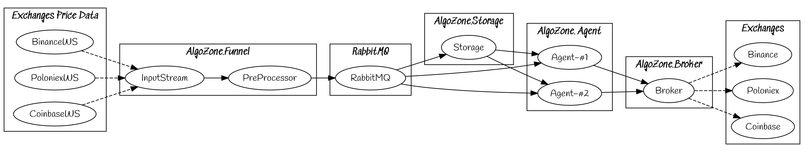

# AlgoZone.Funnel
The Funnel is the first service in the AlgoZone algorithmic trading platform

# Description
The funnel is the first part of the platform where all information is collected and streamed into the platform.

Every exchange will require it's own instance of the funnel running for now, since it will be developed to be ran in Docker.
This will allow for easier deployment.

# To Do

#### Main development
- [x] InputStream
- [x] Accept CLI arguments
- [ ] PreProcessor
- [ ] Connection with RabbitMQ

#### Exchange development
- [ ] Binance (WIP)
- [ ] Poloniex
- [ ] Coinbase

#### Deployment
- [ ] Setup Dockerfile
- [ ] Create Docker compose file